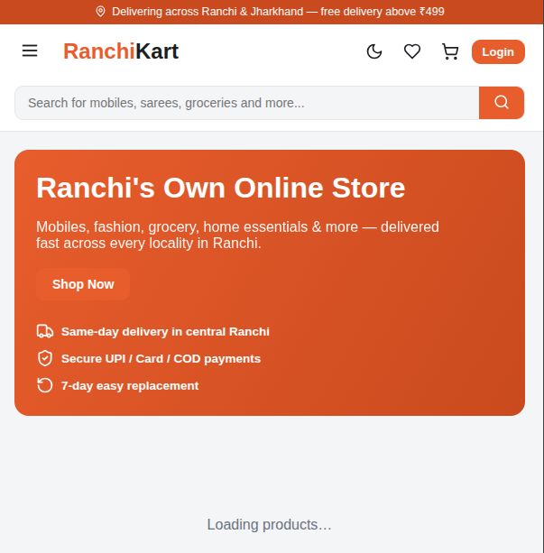

# RanchiKart

A premium, Flipkart‑style ecommerce platform focused on stamps, stationery, and custom boards. RanchiKart offers a sleek, dark‑mode enabled shopping experience with secure payments and robust backend services.

---

## Tech Stack

---

## Core Features

- **Multi‑page storefront** – Home, categories, search, product details, authentication, cart, checkout, and terms.
- **Rich product pages** – Image galleries, variants, custom size/text options, specifications, and return policies.
- **Dynamic categories** – Stamps, stationery, official boards, name boards, light boards, safety boards, menu boards, and more.
- **Dark mode** – Persisted via Zustand for a comfortable night‑time experience.
- **Secure payments** – Razorpay integration with order creation and signature verification (fallback mock for local development).
- **Rate limiting** – Redis‑backed throttling to protect the API.
- **JWT authentication** – Robust user sessions and role‑based access.

---

## Live Demo

Visit the live demo to explore RanchiKart’s UI and checkout flow.

---

## License

MIT © 2026 RanchiKart Team
