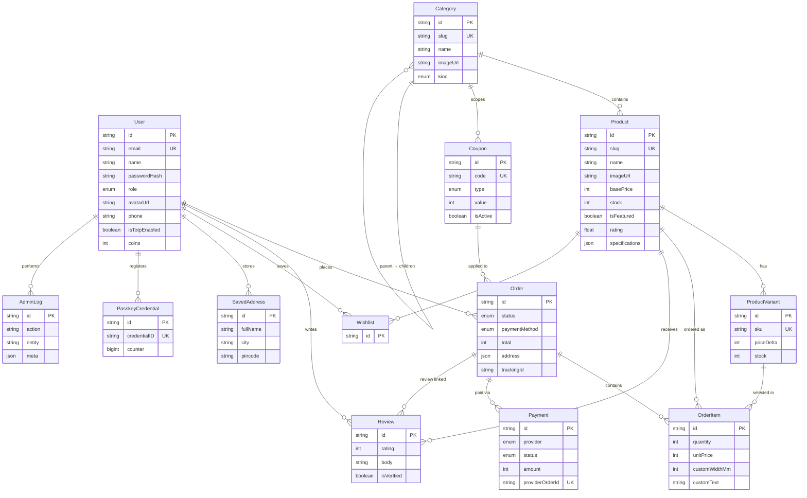

<p align="center">
  
</p>

<h1 align="center">Ranchi Kart</h1>

<p align="center">
  <strong>A production‑grade, full‑stack ecommerce platform built for Ranchi — delivering stamps, stationery, custom boards, and everyday essentials with a premium shopping experience.</strong>
</p>

<p align="center">
  <a href="https://ranchikart.vercel.app"></a>
  <a href="https://ranchikart.onrender.com/docs"></a>
</p>

<p align="center">
  <a href="https://github.com/nishuR31/ranchiKart/actions/workflows/backend.yaml">
    
  </a>
  <a href="https://github.com/nishuR31/ranchiKart/actions/workflows/frontend.yaml">
    
  </a>
  <a href="https://github.com/nishuR31/ranchiKart/actions/workflows/CI.yaml">
    
  </a>
</p>
<p align="center">
  
  
  
  
  
  
  
  
  
  
  
  
</p>

---

## Overview

RanchiKart is a hyper‑local ecommerce platform purpose‑built for Ranchi. It covers the full commerce lifecycle — browsing a categorised product catalog, searching and filtering, adding items to cart with custom dimensions and text, secure checkout via Razorpay (UPI / Card / Net Banking / COD), real‑time order tracking, reviews, wishlists, coupon redemption, and a complete admin dashboard for catalog and order management.

The platform follows an **MVCS (Model → Validation → Controller → Service)** architecture on the backend, with Zod schemas enforcing strict request validation and auto‑generating Swagger documentation. The frontend is a React SPA with Zustand‑powered state management, dark mode persistence, and an Axios interceptor layer handling JWT refresh transparently.

---

## Architecture

### Backend

```
backend/src/
├── config/          # Env validation (Zod), Prisma, Redis, Fastify server, Razorpay, SMTP
├── controllers/     # Request handling — auth, admin, catalog, orders, payments, reviews, users, wishlist, coupons
├── services/        # Business logic layer — one service per domain
├── repositories/    # Data access layer (Prisma queries)
├── middleware/      # Auth guards, role checks, rate limiting, image upload pipeline
├── routeSchemas/    # Zod schemas attached to Fastify routes (auto Swagger + validation)
├── routes/          # Route registrations under /api/v1 prefix
├── utils/           # JWT helpers, imgbb uploader, error classes, response formatters
└── types/           # TypeScript declarations (Fastify augmentation, etc.)
```

### Frontend

```
frontend/src/
├── pages/           # Route pages — Home, Auth, Product, Category, Cart, Checkout, Profile, Admin, Orders
├── components/      # Reusable UI — ProductCard, StarRating, Navbar, Footer, etc.
├── store/           # Zustand stores — auth (JWT + user), shop (cart, wishlist, toast)
├── lib/             # API client (Axios + interceptors), currency formatting
└── styles.css       # Full design system — dark mode, responsive layouts, animations
```

---

## Data Flow Diagram

```mermaid
flowchart TD
    Customer((Customer))
    Admin((Admin))
    GoogleOAuth((Google OAuth))
    PaymentGateway((Payment Gateway))
    EmailProvider((Email Provider))

    AuthProcess("1.0\nAuthentication & Security")
    CatalogProcess("2.0\nCatalog & Products")
    OrderProcess("3.0\nOrder Management")
    PaymentProcess("4.0\nPayment Processing")
    AdminProcess("5.0\nAdmin Operations")

    DB_User[(D1: Users, Passkeys & Tokens)]
    DB_Product[(D2: Products & Categories)]
    DB_Order[(D3: Orders & OrderItems)]
    DB_Payment[(D4: Payments)]

    Customer -- "Credentials, TOTP, Passkey" --> AuthProcess
    AuthProcess -- "Auth State, Tokens" --> Customer
    GoogleOAuth -- "OAuth Code/Profile" --> AuthProcess
    AuthProcess -- "Email Auth Link" --> EmailProvider
    AuthProcess -- "Read/Write User Data" --> DB_User

    Customer -- "Search & Filter queries" --> CatalogProcess
    CatalogProcess -- "Product details" --> Customer
    CatalogProcess -- "Read Product Data" --> DB_Product

    Customer -- "Cart items, Checkout request" --> OrderProcess
    OrderProcess -- "Order Status updates" --> Customer
    OrderProcess -- "Order confirmation" --> EmailProvider
    OrderProcess -- "Read/Write Order Data" --> DB_Order
    OrderProcess -- "Check stock" --> DB_Product
    OrderProcess -- "Read User Address" --> DB_User

    Customer -- "Payment details" --> PaymentProcess
    PaymentProcess -- "Payment status" --> Customer
    PaymentProcess -- "Charge request / Verify Signature" --> PaymentGateway
    PaymentGateway -- "Webhook / Success Event" --> PaymentProcess
    PaymentProcess -- "Write Payment Record" --> DB_Payment
    PaymentProcess -- "Update Order Status" --> DB_Order

    Admin -- "Dashboard queries, Entity updates" --> AdminProcess
    AdminProcess -- "Metrics, Action results" --> Admin
    AdminProcess -- "Manage Users" --> DB_User
    AdminProcess -- "Manage Catalog" --> DB_Product
    AdminProcess -- "Manage Orders" --> DB_Order
    AdminProcess -- "Manage Payments" --> DB_Payment

    classDef entity fill:#f9f,stroke:#333,stroke-width:2px;
    classDef process fill:#bbf,stroke:#333,stroke-width:2px;
    classDef datastore fill:#ffb,stroke:#333,stroke-width:2px;

    class Customer,Admin,GoogleOAuth,PaymentGateway,EmailProvider entity;
    class AuthProcess,CatalogProcess,OrderProcess,PaymentProcess,AdminProcess process;
    class DB_User,DB_Product,DB_Order,DB_Payment datastore;
```



---

## Core Features

### 🔐 Authentication & Security

RanchiKart supports **five** authentication methods — all producing the same JWT access + refresh token pair:

| Method | How it works |
|---|---|
| **Email + Password** | Argon2‑hashed passwords, Zod‑validated registration and login |
| **Google OAuth 2.0** | Server‑side code exchange → auto‑creates or links user account |
| **Magic Links** | Passwordless email login — SMTP delivers a one‑time token link |
| **TOTP (2FA)** | Time‑based one‑time password via QR code setup (Google Authenticator, Authy) |
| **WebAuthn Passkeys** | Biometric / hardware key login using the WebAuthn standard |

- Access tokens are short‑lived (15 min); refresh tokens rotate on each use (7 day TTL)
- Refresh tokens are stored as HTTP‑only secure cookies — the frontend Axios interceptor auto‑refreshes on 401
- Role‑based access control: `USER`, `MANAGER`, `ADMIN`, `SELLER`
- Redis‑backed rate limiting protects all endpoints

### 🖼️ Image Upload Pipeline

Images flow through a multi‑stage processing pipeline before reaching the database:

```
Client sends multipart/form-data with field "image"
        │
        ▼
┌─────────────────────────────────┐
│  @fastify/multipart             │  Streams the upload (10 MB max, 1 file per request)
│  MIME validation                │  Allows: jpeg, png, webp, gif, avif
└────────────┬────────────────────┘
             │
             ▼
┌─────────────────────────────────┐
│  sharp                          │  Resizes to fit within max bounds (aspect‑ratio preserved)
│  → WebP conversion              │  Products: 1200×1200 @ 82% · Categories: 800×800 @ 80%
│  → withoutEnlargement           │  Avatars: 400×400 @ 85% · Never upscales small images
└────────────┬────────────────────┘
             │
             ▼
┌─────────────────────────────────┐
│  ImgBB API                      │  Base64‑encoded upload via URLSearchParams
│  → Returns hosted URL           │  Permanent hosting (e.g. https://i.ibb.co/…/image.webp)
└────────────┬────────────────────┘
             │
             ▼
┌─────────────────────────────────┐
│  Middleware injects imageUrl    │  req.body = { ...textFields, imageUrl: "https://..." }
│  into req.body                  │  Controller sees the same shape as a plain JSON request
└────────────┬────────────────────┘
             │
             ▼
      Controller → Service → Prisma → PostgreSQL (imageUrl stored as String)
```

**Dual‑mode support**: The same routes accept either `multipart/form-data` (with an image file) or plain `application/json` (with an `imageUrl` string). The middleware is a no‑op for non‑multipart requests — controllers don't need to know which mode was used.

Text fields in multipart requests are smart‑coerced: `"1500"` → `1500`, `"true"` → `true`, `"[1,2]"` → `[1,2]`.

### 🛒 Cart & Checkout

- Cart is managed server‑side — items persist across sessions via the authenticated user's order context
- Custom dimensions (`customWidthMm`, `customHeightMm`) and custom text supported per item for stamps, boards, and stationery products
- Product variants (size, color, material) with independent stock tracking and price deltas
- Coupon system with percentage or fixed‑amount discounts, category scoping, usage limits, and expiry dates
- Shipping fee calculation and discount application happen atomically during order creation

### 💳 Payments

- **Razorpay integration** — order creation, payment capture, and cryptographic signature verification
- Supports UPI, Card, Net Banking, and Coins payment methods
- Each payment records the full provider response (`providerOrderId`, `providerPaymentId`, `providerSignature`, `rawResponse`)
- Payment status lifecycle: `CREATED` → `AUTHORIZED` → `CAPTURED` (or `FAILED` / `REFUNDED`)
- Order status transitions: `PENDING_PAYMENT` → `PAID` → `PROCESSING` → `SHIPPED` → `DELIVERED`
- Webhook‑ready: Razorpay webhook events update payment and order status server‑side

### 👤 User Profile

- Name, phone, and avatar management
- Avatar upload uses the same image pipeline (sharp → ImgBB → stored URL)
- Multiple saved addresses with default selection for streamlined checkout
- Password change (supports users who registered via OAuth and have no initial password)
- TOTP 2FA enable / disable with QR code provisioning

### 📦 Catalog

- Hierarchical categories with parent‑child relationships (e.g. Boards → Name Boards, Safety Boards)
- Each product belongs to a `ProductKind` enum (20 types: `STAMP`, `BOARD`, `STATIONERY`, `ELECTRONIC`, `CLOTHING`, etc.)
- Rich product data: gallery images, specifications (JSON), highlights, tags, return policies, warranty info, dispatch estimates
- Featured products and active/inactive toggles for catalog curation
- Full‑text search, category filtering, sorting (by rating, price, recency), and pagination

### ⭐ Reviews & Wishlists

- Authenticated users can rate and review products (one review per user per product)
- Reviews can be linked to a specific order for verified purchase badges
- Wishlist is a simple toggle — add or remove any product with a single endpoint
- Product rating and review count are denormalised on the Product model for fast reads

### 🛡️ Admin Dashboard

- **Dashboard**: Total revenue, order count, user count, product count, recent orders, revenue chart
- **Product Management**: Create, update, toggle active/featured, with image upload support
- **Category Management**: Full CRUD with image upload, hierarchical parent assignment
- **Order Management**: View all orders with filters, update status with tracking IDs and notes
- **User Management**: View users, ban/unban with reason, change roles
- **Coupon Management**: Create, update, toggle, delete — with category scoping and usage tracking
- **Audit Logging**: Every admin action is recorded in `AdminLog` with entity, action, and metadata
- Role guards: `requireAdmin` for destructive ops, `requireManager` for read‑heavy dashboards

---

## Database Schema

PostgreSQL managed through Prisma ORM — 12 interconnected tables:



### Key Data Relationships

| Relationship | Cardinality | Purpose |
|---|---|---|
| `User → Order` | One‑to‑Many | A user can place many orders |
| `Order → OrderItem → Product` | One‑to‑Many‑to‑One | Each order contains multiple line items, each referencing a product |
| `OrderItem → ProductVariant` | Many‑to‑One (optional) | Line items can optionally specify a variant (size, color) |
| `Order → Payment` | One‑to‑Many | An order can have multiple payment attempts |
| `Product → Category` | Many‑to‑One | Every product belongs to exactly one category |
| `Category → Category` | Self‑referencing | Hierarchical categories (parent ↔ children) |
| `Coupon → Category` | Many‑to‑One (optional) | Coupons can be scoped to a specific category |
| `Coupon → Order` | One‑to‑Many | Track which orders used a coupon |
| `User → PasskeyCredential` | One‑to‑Many | WebAuthn passkey storage per user |
| `Review → Order` | Many‑to‑One (optional) | Verified‑purchase reviews link back to the order |
| `AdminLog → User` | Many‑to‑One | Every admin action is audited with the admin's user ID |

---

## API Surface

All routes are mounted under `/api/v1`. Auto‑generated Swagger docs are available at `/docs`.

| Domain | Routes | Key Endpoints |
|---|---|---|
| **Auth** | `POST /auth/register`, `POST /auth/login`, `POST /auth/refresh`, `POST /auth/logout` | Standard JWT flow |
| **OAuth** | `GET /auth/google`, `GET /auth/google/callback` | Google OAuth 2.0 server‑side flow |
| **Magic Link** | `POST /auth/magic-link`, `GET /auth/magic-link/verify` | Passwordless email login |
| **TOTP** | `POST /auth/totp/enable`, `POST /auth/totp/verify`, `POST /auth/totp/disable` | Two‑factor authentication |
| **Passkeys** | `POST /auth/passkey/register/*`, `POST /auth/passkey/authenticate/*` | WebAuthn biometric login |
| **Profile** | `GET /users/me`, `PUT /users/me/profile` (multipart or JSON) | Avatar upload, name/phone update |
| **Addresses** | `GET/POST/DELETE /users/me/addresses` | Saved shipping addresses |
| **Catalog** | `GET /products`, `GET /products/:slug`, `GET /categories` | Search, filter, paginate |
| **Cart & Orders** | `POST /orders`, `GET /orders`, `GET /orders/:id` | Checkout, order history |
| **Payments** | `POST /payments/create-order`, `POST /payments/verify` | Razorpay integration |
| **Reviews** | `POST /reviews`, `GET /reviews` | Product ratings |
| **Wishlist** | `GET/POST/DELETE /wishlist` | Save products for later |
| **Coupons** | `POST /coupons/apply` | Apply discount codes |
| **Admin** | `GET /admin/dashboard`, `CRUD /admin/products`, `CRUD /admin/categories`, etc. | Full admin panel API |

---

## Deployment

| Component | Platform | Details |
|---|---|---|
| **Backend API** | Render | Fastify on Bun runtime, auto‑deploys from `main` branch |
| **Frontend SPA** | Vercel | Vite build with SPA rewrites configured in `vercel.json` |
| **Database** | Prisma Accelerate / NeonDB | Managed PostgreSQL with connection pooling |
| **Cache** | Redis Cloud | Session caching, rate limiting, token blacklisting |
| **Image Hosting** | ImgBB | Free permanent image hosting via API |
| **Email** | Gmail SMTP | Order confirmations, magic link emails |
| **Containerisation** | Docker Compose | Production‑ready multi‑service setup with health checks |

---

## Contributors

<table>
  <tr>
    <td align="center" valign="top" width="20%">
      <a href="https://github.com/technical-aditya-rathore">
        <br />
        <sub><b>Aditya</b></sub>
      </a><br />
      <sub>• Frontend Development<br />• UI/UX & Research<br />• Business Logic & Perf</sub>
    </td>
    <td align="center" valign="top" width="20%">
      <a href="https://github.com/tushar-kumar06">
        <br />
        <sub><b>Tushar</b></sub>
      </a><br />
      <sub>• System Design & Docs<br />• Requirement Analysis<br />• Monitoring & Logging</sub>
    </td>
    <td align="center" valign="top" width="20%">
          <a href="https://github.com/surxz">
      <br />
      <sub><b>Suraj</b></sub><br />
      <sub>• Quality Assurance<br />• Functional & UI Testing<br />• Bug Reporting & E2E</sub>
    </td>
     <td align="center" valign="top" width="20%">
      <a href="https://github.com/nishur31">
        <br />
        <sub><b>Nishan</b></sub>
      </a><br />
      <sub>• Backend Development<br />• DevOps & Deployment</sub>
    </td>
    <td align="center" valign="top" width="20%">
      <br />
      <sub><b>Adarsh</b></sub><br />
      <sub>• Project Coordination<br />• Product & Content Mgmt<br />• UAT & Demo Support</sub>
    </td>
  </tr>
</table>

---

## License

**Proprietary** — Copyright © 2026 RanchiKart. All rights reserved.

This software and its source code are confidential. Unauthorized use, reproduction, or distribution is strictly prohibited. See [LICENSE](LICENSE) for details.
